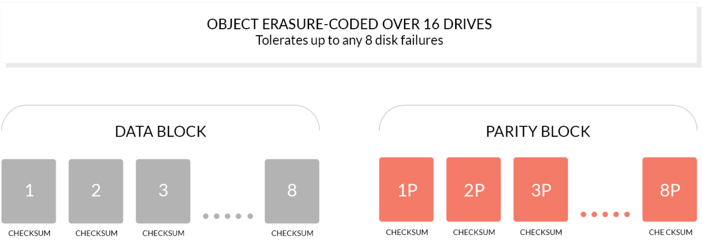
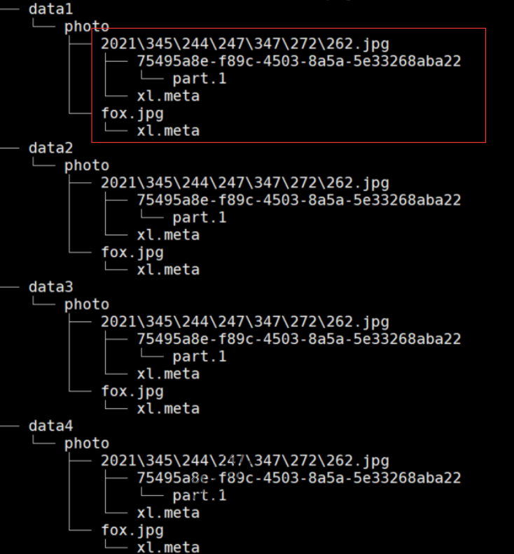
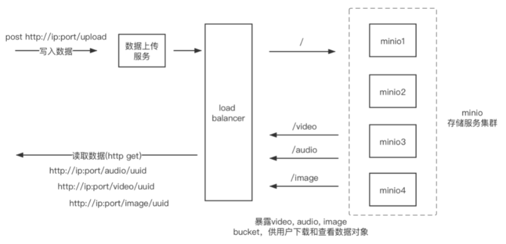
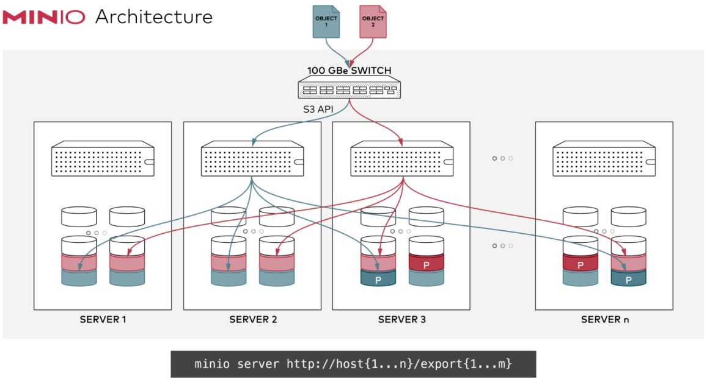

# MinIO简介

MinIO 是在 GNU Affero 通用公共许可证 v3.0 下发布的高性能对象存储。 它是与 Amazon S3 云存储服务兼容的 API。 使用 MinIO 为机器学习、分析和应用程序数据工作负载构建高性能基础架构。

## 基础概念

>   object

一个[对象](https://docs.min.io/minio/baremetal/introduction/minio-overview.html#objects)是二进制数据，有时被称为二进制大对象（BLOB）。Blob 可以是图像、音频文件、电子表格，甚至是二进制可执行代码。像 MinIO 这样的对象存储平台提供了用于存储、检索和搜索 blob 的专用工具和功能。

>   buckets

MinIO Object Storage 使用[桶](https://docs.min.io/minio/baremetal/introduction/minio-overview.html#buckets)来组织对象。存储桶类似于文件系统中的文件夹或目录，其中每个存储桶可以容纳任意数量的对象。MinIO 存储桶提供与 AWS S3 存储桶相同的功能。

>   Drive

即存储数据的磁盘，在 MinIO 启动时，以参数的方式传入。Minio 中所有的对象数据都会存储在 Drive 里  

>   set

即一组 Drive 的集合，分布式部署根据集群规模自动划分一个或多个 Set ，每个 Set 中的Drive 分布在不同位置。一个对象存储在一个Set 上。（For example: {1...64} is divided into 4sets each of size 16.）  

-   一个对象存储在一个Set上
-   一个集群划分为多个Set
-   一个Set包含的Drive数量是固定的，默认由系统根据集群规模自动计算得出
-   一个SET中的Drive尽可能分布在不同的节点上  

## 纠删码

**作用：**

纠删码是一种恢复丢失和损坏数据的数学算法， Minio采用Reed-Solomon code将对象拆分成N/2数据和N/2 奇偶校验块。 这就意味着如果是12块盘，一个对象会被分成6个数据块、6个奇偶校验块，你可以丢失任意6块盘（不管其是存放的数据块还是奇偶校验块），你仍可以从剩下的盘中的数据进行恢复。

**原理**
纠删码的工作原理和RAID或者复制不同，像RAID6可以在损失两块盘的情况下不丢数据，而Minio纠删码可以在丢失一半的盘的情况下，仍可以保证数据安全。 而且Minio纠删码是作用在对象级别，可以一次恢复一个对象，而RAID是作用在卷级别，数据恢复时间很长。 Minio对每个对象单独编码，存储服务一经部署，通常情况下是不需要更换硬盘或者修复。Minio纠删码的设计目标是为了性能和尽可能的使用硬件加速。



>   位衰减bit rot保护

位衰减又被称为数据腐化`Data Rot`、无声数据损坏`Silent Data Corruption`,是目前硬盘数据的一种严重数据丢失问题。硬盘上的数据可能会神不知鬼不觉就损坏了，也没有什么错误日志。正所谓明枪易躲，暗箭难防，这种背地里犯的错比硬盘直接咔咔宕了还危险。 不过不用怕，Minio纠删码采用了高速 [HighwayHash](https://github.com/minio/highwayhash) 基于哈希的校验和来防范位衰减。

## 存储形式

文件对象上传到 MinIO ，会在对应的数据存储磁盘中，以 Bucket 名称为目录，文件名称为下一级目录，文件名下是 part.1 和 xl.meta(老版本，最新版本如下图)，前者是编码数据块及检验块，后者是元数据文件。  



## 存储方案



## 应用场景

互联网海量非结构化数据的存储需求

-   电商网站：海量商品图片
-   视频网站：海量视频文件
-   网盘：海量文件
-   社交网站：海量图片

# 环境部署

## Docker安装单机模式


该模式下，Minio只在一台服务器上搭建服务，且数据都存在单块磁盘上，该模式存在单点风险，主要用作开发、测试等使用

> docker

```shell
# -d 后台启动
# 9001 控制台端口
# -v 指定挂载的目录 第一个位置存储bucket的位置，object存储在对应的bucket下
# -e 指定控制台 用户名、密码

docker run -d -p 9000:9000 -p 9001:9001 --name minio \
-e "MINIO_ROOT_USER=admin" \
-e "MINIO_ROOT_PASSWORD=12345678" \
-v /minio/data:/data \
-v /minio/config:/root/.minio \
minio/minio server --console-address ":9001" /data
```

> centos 7

```shell
minio --config-dir ~/tenant1 server --address :9001 /disk1/data/tenant1
```

## 单主机，多硬盘


该模式下，Minio在一台服务器上搭建服务，但数据分散在多块（大于4块）磁盘上，提供了数据上的安全保障

> centos 7

```shell
minio --config-dir ~/tenant1 server --address :9001 /disk1/data/tenant1 /disk2/data/tenant1 /disk3/data/tenant1 /disk4/data/enant1
```

>  docker-compose

docker-compose只能在单主机部署多个分布式MinIO实例，分布式MinIO实例将部署在同一主机上的多个容器中。

安装docker-compose后执行以下操作：

```shell
mkdir -p /date/minio
cd /date/minio

wget https://raw.githubusercontent.com/minio/minio/master/docs/orchestration/docker-compose/docker-compose.yaml
wget https://raw.githubusercontent.com/minio/minio/master/docs/orchestration/docker-compose/nginx.conf

docker-compose up -d
```

查看运行的容器

```shell
[root@master minio]# docker-compose ps -a
     Name                   Command                  State                   Ports             
-----------------------------------------------------------------------------------------------
minio_minio1_1   /usr/bin/docker-entrypoint ...   Up (healthy)   9000/tcp                      
minio_minio2_1   /usr/bin/docker-entrypoint ...   Up (healthy)   9000/tcp                      
minio_minio3_1   /usr/bin/docker-entrypoint ...   Up (healthy)   9000/tcp                      
minio_minio4_1   /usr/bin/docker-entrypoint ...   Up (healthy)   9000/tcp                      
minio_nginx_1    /docker-entrypoint.sh ngin ...   Up             80/tcp, 0.0.0.0:9000->9000/tcp
```

使用nginx进行了负载均衡，浏览器访问：http://192.168.4.10:9000

默认情况下会创建4个minio实例，你可以添加更多的MinIO服务（最多总共16个）到你的MinIO Comose deployment。

## 纠删码模式

Minio使用纠删码 `erasure code` 和校验和 `checksum` 来保护数据免受硬件故障和无声数据损坏。 即便丢失一半数量（N/2）的硬盘，仍然可以恢复数据。

使用MinIO Docker镜像，在8块盘中启动MinIO服务

```shell
docker run -d -p 9000:9000 -p 9001:9001 --name minio \
-e "MINIO_ROOT_USER=admin" \
-e "MINIO_ROOT_PASSWORD=12345678" \
-v /mnt/data1:/data1 \
-v /mnt/data2:/data2 \
-v /mnt/data3:/data3 \
-v /mnt/data4:/data4 \
-v /mnt/data5:/data5 \
-v /mnt/data6:/data6 \
-v /mnt/data7:/data7 \
-v /mnt/data8:/data8 \
minio/minio server /data{1...8} --console-address ":9001"
```

## 分布式模式(多主机、多硬盘)

分布式Minio可以让你将多块硬盘（甚至在不同的机器上）组成一个对象存储服务。由于硬盘分布在不同的节点上，分布式Minio避免了单点故障。




该模式是Minio服务最常用的架构，通过共享一个access*key和secret*key,在多台（2-32）服务器上搭建服务，且数据分散在多块（大于4块，无上限）磁盘上，提供了较为强大的数据冗余机制（Reed-Solomon纠删码）。

### 分布式存储可靠性常用方法

分布式存储，很关键的点在于数据的可靠性，即保证数据的完整，不丢失，不损坏。只有在可靠性实现的前提下，才有了追求一致性、高可用、高性能的基础。而对于在存储领域，一般对于保证数据可靠性的方法主要有两类，一类是冗余法，一类是校验法。

#### 冗余

冗余法最简单直接，即对存储的数据进行副本备份，当数据出现丢失，损坏，即可使用备份内容进行恢复，而副本 备份的多少，决定了数据可靠性的高低。这其中会有成本的考量，副本数据越多，数据越可靠，但需要的设备就越多，成本就越高。可靠性是允许丢失其中一份数据。当前已有很多分布式系统是采用此种方式实现，如 Hadoop 的文件系统（3个副本），Redis 的集群，MySQL 的主备模式等。

#### 校验

校验法即通过校验码的数学计算的方式，对出现丢失、损坏的数据进行校验、还原。注意，这里有两个作用，一个校验，通过对数据进行校验和( checksum )进行计算，可以检查数据是否完整，有无损坏或更改，在数据传输和保存时经常用到，如 TCP 协议；二是恢复还原，通过对数据结合校验码，通过数学计算，还原丢失或损坏的数据，可以在保证数据可靠的前提下，降低冗余，如单机硬盘存储中的 RAID技术，纠删码（Erasure Code）技术等。MinIO 采用的就是纠删码技术。

### 分布式Minio优势

#### 数据保护

分布式Minio采用 纠删码来防范多个节点宕机和位衰减 bit rot 。
分布式Minio至少需要4个硬盘，使用分布式Minio自动引入了纠删码功能。

#### 高可用

单机Minio服务存在单点故障，相反，如果是一个有N块硬盘的分布式Minio,只要有N/2硬盘在线，你的数据就是安全的。不过你需要至少有N/2+1个硬盘来创建新的对象。

例如，一个16节点的Minio集群，每个节点16块硬盘，就算8台服务器宕机，这个集群仍然是可读的，不过你需要9台服务器才能写数据。

#### 一致性

Minio在分布式和单机模式下，所有读写操作都严格遵守read-after-write一致性模型。

### CentOS7 分布式Minio

[资料](https://blog.csdn.net/alanzy123/article/details/115169035)

[资料](https://www.jianshu.com/p/bfde2495aa94)

部署minio集群，四个节点每个节点挂载1个目录

> 安装二进制minio文件

```shell
mkdir -p /software/minio/data
cd /software/minio
wget https://dl.min.io/server/minio/release/linux-amd64/minio
chmod +x minio
```

在部署中的每个节点上输入以下命令。

- 部署有顺序的主机名（即三个节点 minio1，minio2，minio3）。
- 每个节点都具有使用顺序命名语义（磁盘安装/software/minio/data）。
- 在三台服务器都执行下面文件

```shell
export MINIO_ROOT_USER=admin && export MINIO_ROOT_PASSWORD=12345678 
/software/minio/minio server http://minio{1..4}:9000/software/minio/data --console-address ":9001"
             
# nohup & 后台运行 例如：nohup java -jar app.jar& 
```

| MINIO_ROOT_USER           | 用户名                                                       |
| ------------------------- | ------------------------------------------------------------ |
| MINIO_ROOT_PASSWORD       | 密码，最少8位                                                |
| MINIO_SERVER_URL          | MinIO 控制台用于连接到 MinIO 服务器的 URL 主机名。指定管理与 MinIO 部署的连接的负载均衡器的主机名。这个变量是*必需的*，如果指定其TLS证书**不**包含MinIO服务器主机的IP地址作为 [**主题备用名称**](https://tools.ietf.org/html/rfc5280.html#section-4.2.1.6)。主机名 *必须*由 TLS 证书 SAN 条目之一覆盖。 |
| minio{1...3}              | 分布式部署中每个服务器的 DNS 主机名指定为单个服务器池。该命令使用 MinIO 扩展符号`{x...y}`来表示一个连续的系列。具体来说，主机名 `https://minio{1...3}`扩展为：`minio1、minio2、minio3`扩展的主机名集必须包括服务器池中的所有 MinIO 服务器节点。千万**不能**使用空格分隔系列（例如），作为MinIO将它们视为单独的服务器池，而不是主机划分为一个服务器池。`"HOSTNAME1 HOSTNAME2"` |
| /mnt/disk{1...2}/data     | 主机上每个磁盘的路径。`/data`是一个可选文件夹，`minio`服务器在其中存储与部署相关的所有信息。该命令使用 MinIO 扩展符号`{x...y}`来表示一个连续的系列。具体来说， `/mnt/disk{1...2}/data`扩展为：`/mnt/disk1/data  /mnt/disk2/data`有关为进程配置后备存储的更多信息 |
| --console-address ":9001" | 嵌入式[MinIO 控制台](https://docs.min.io/minio/baremetal/console/minio-console.html#minio-console)在其上侦听传入连接的静态端口。省略以允许 MinIO 为 MinIO Console 选择动态端口。打开根节点主机名的浏览器 `minio1:9000`会自动重定向到控制台。 |

还可以配置其他环境变量，部署中的所有 MinIO 节点都应该包含相同的环境变量，每个变量的值都相同。

访问主机9001端口，四台均显示如下信息，集群部署成功


> 配置nginx.conf

负载均衡配置

```properties
upstream minio_server{
        server 192.168.10.11:9000;
        server 192.168.10.12:9000;
        server 192.168.10.13:9000;
        server 192.168.10.14:9000;
}

server {
    listen       9000;
    charset utf-8;
    server_name  192.168.10.100;

    location / {
        proxy_pass http://minio_server;
        # 可选配置
        proxy_set_header Host $http_host;
        proxy_set_header X-Forwarded-For $remote_addr;
        client_body_buffer_size 10M;
        client_max_body_size 10G;
        proxy_buffers 1024 4k;
        proxy_read_timeout 300;
        proxy_next_upstream error timeout http_404;
	}
}
```

客户端访问nginx服务器9000端口：192.168.10.100:9000

# 客户端使用

MinIO Client (mc)为ls，cat，cp，mirror，diff，find等UNIX命令提供了一种替代方案。它支持文件系统和兼容Amazon S3的云存储服务（AWS Signature v2和v4）。

```shell
ls 列出文件和文件夹。
mb 创建一个存储桶或一个文件夹。
cat 显示文件和对象内容。
pipe 将一个STDIN重定向到一个对象或者文件或者STDOUT。
share 生成用于共享的URL。
cp 拷贝文件和对象。
mirror 给存储桶和文件夹做镜像。
find 基于参数查找文件。
diff 对两个文件夹或者存储桶比较差异。
rm 删除文件和对象。
events 管理对象通知。
watch 监视文件和对象的事件。
policy 管理访问策略。
config 管理mc配置文件。
update 检查软件更新。
version 输出版本信息。
```

## 部署客户端mc

| 平台      | CPU架构      | URL                                                     |
| --------- | ------------ | ------------------------------------------------------- |
| GNU/Linux | 64-bit Intel | http://dl.minio.org.cn/client/mc/release/linux-amd64/mc |

```shell
wget http://dl.minio.org.cn/client/mc/release/linux-amd64/mc
chmod +x mc
./mc --help
mv mc /usr/local/sbin/
```

| 平台              | CPU架构      | URL                                                          |
| ----------------- | ------------ | ------------------------------------------------------------ |
| Microsoft Windows | 64-bit Intel | http://dl.minio.org.cn/client/mc/release/windows-amd64/ mc.exe |

## 配置mc

`mc` 将所有的配置信息都存储在 ``~/.mc/config.json` 文件中

```shell
# 查询mc host配置
mc config host ls
# 添加minio服务
mc config host add minio-server http://192.168.3.14:9000 admin 12345678
# 删除host
mc config host remove minio-server
```

## mc命令的使用

|                                                              |                                                              |                                                              |
| :----------------------------------------------------------- | :----------------------------------------------------------- | ------------------------------------------------------------ |
| [**ls** - 列出存储桶和对象](http://docs.minio.org.cn/docs/master/minio-client-complete-guide#ls) | [**mb** - 创建存储桶](http://docs.minio.org.cn/docs/master/minio-client-complete-guide#mb) | [**cat** - 合并对象](http://docs.minio.org.cn/docs/master/minio-client-complete-guide#cat) |
| [**cp** - 拷贝对象](http://docs.minio.org.cn/docs/master/minio-client-complete-guide#cp) | [**rm** - 删除对象](http://docs.minio.org.cn/docs/master/minio-client-complete-guide#rm) | [**pipe** - Pipe到一个对象](http://docs.minio.org.cn/docs/master/minio-client-complete-guide#pipe) |
| [**share** - 共享](http://docs.minio.org.cn/docs/master/minio-client-complete-guide#share) | [**mirror** - 存储桶镜像](http://docs.minio.org.cn/docs/master/minio-client-complete-guide#mirror) | [**find** - 查找文件和对象](http://docs.minio.org.cn/docs/master/minio-client-complete-guide#find) |
| [**diff** - 比较存储桶差异](http://docs.minio.org.cn/docs/master/minio-client-complete-guide#diff) | [**policy** - 给存储桶或前缀设置访问策略](http://docs.minio.org.cn/docs/master/minio-client-complete-guide#policy) |                                                              |
| [**config** - 管理配置文件](http://docs.minio.org.cn/docs/master/minio-client-complete-guide#config) | [**watch** - 事件监听](http://docs.minio.org.cn/docs/master/minio-client-complete-guide#watch) | [**events** - 管理存储桶事件](http://docs.minio.org.cn/docs/master/minio-client-complete-guide#events) |
| [**update** - 管理软件更新](http://docs.minio.org.cn/docs/master/minio-client-complete-guide#update) | [**version** - 显示版本信息](http://docs.minio.org.cn/docs/master/minio-client-complete-guide#version) |                                                              |

### 上传与下载

```shell
# 查询minio服务上的所有buckets(文件和文件夹)
mc ls minio-server
# 下载文件
mc cp minio-server/tulingmall/fox/fox.jpg /tmp/
#删除文件
mc rm minio-server/tulingmall/fox/fox.jpg
#上传文件
mc cp zookeeper.out minio-server/tulingmall/
```

### Bucket管理

```shell
# 创建bucket
mc mb minio-server/bucket01
# 删除bucket
mc rb minio-server/bucket02
# bucket不为空，可以强制删除 慎用
mc rb --force minio-server/bucket01
#查询bucket03磁盘使用情况
mc du minio-server/bucket03
```

### mc admin

MinIO Client（mc）提供了“ admin”子命令来对MinIO部署执行管理任务。

```shell
service 服务重启并停止所有MinIO服务器
update 更新更新所有MinIO服务器
info 信息显示MinIO服务器信息
user 用户管理用户
group 小组管理小组
policy MinIO服务器中定义的策略管理策略
config 配置管理MinIO服务器配置
heal 修复MinIO服务器上的磁盘，存储桶和对象
profile 概要文件生成概要文件数据以进行调试
top 顶部提供MinIO的顶部统计信息
trace 跟踪显示MinIO服务器的http跟踪
console 控制台显示MinIO服务器的控制台日志
prometheus Prometheus管理Prometheus配置
kms kms执行KMS管理操作
```

#### 用户管理

```shell
mc admin user --help
#新建用户
mc admin user add minio-server fox
mc admin user add minio-server fox02 12345678
#查看用户
mc admin user list minio-server
#禁用用户
mc admin user disable minio-server fox02
#启用用户
mc admin user disable minio-server fox02
#查看用户信息
mc admin user info minio-server fox
#删除用户
mc admin user remove minio-server fox02
```

#### 策略管理

policy命令，用于添加，删除，列出策略，获取有关策略的信息并为MinIO服务器上的用户设置策略。

```shell
mc admin policy --help
#列出MinIO上的所有固定策略
mc admin policy list minio-server
# 查看plicy信息
mc admin policy info minio-server readwrite
```

**添加新的策略**

```json
{
    "Version": "2012-10-17",
    "Statement": [
        {
            "Effect": "Allow",
            "Action": [
                "s3:GetBucketLocation",
                "s3:GetObject"
            ],
            "Resource": [
                "arn:aws:s3:::tulingmall"
            ]
        },
        {
            "Effect": "Allow",
            "Action": [
                "s3:*"
            ],
            "Resource": [
                "arn:aws:s3:::tulingmall/*"
            ]
        }
    ]
}
```

# Java SDK

| 桶操作                                                       | 作用                                                         |
| :----------------------------------------------------------- | ------------------------------------------------------------ |
| [bucketExists](https://docs.min.io/docs/java-client-api-reference.html#bucketExists) | 检查存储桶是否存在。                                         |
| [deleteBucketEncryption](https://docs.min.io/docs/java-client-api-reference.html#deleteBucketEncryption) | 删除桶的加密配置。                                           |
| [deleteBucketLifecycle](https://docs.min.io/docs/java-client-api-reference.html#deleteBucketLifecycle) | 删除存储桶的生命周期配置。                                   |
| [deleteBucketNotification](https://docs.min.io/docs/java-client-api-reference.html#deleteBucketNotification) | 删除桶的通知配置。                                           |
| [deleteBucketPolicy](https://docs.min.io/docs/java-client-api-reference.html#deleteBucketPolicy) | 删除桶的桶策略配置。                                         |
| [deleteBucketReplication](https://docs.min.io/docs/java-client-api-reference.html#deleteBucketReplication) | 删除存储桶的存储桶复制配置。                                 |
| [deleteBucketTags](https://docs.min.io/docs/java-client-api-reference.html#deleteBucketTags) | 删除桶的标签。                                               |
| [deleteObjectLockConfiguration](https://docs.min.io/docs/java-client-api-reference.html#deleteObjectLockConfiguration) | 删除存储桶中的对象锁定配置。                                 |
| [getBucketEncryption](https://docs.min.io/docs/java-client-api-reference.html#getBucketEncryption) | 获取桶的加密配置。                                           |
| [getBucketLifecycle](https://docs.min.io/docs/java-client-api-reference.html#getBucketLifecycle) | 获取桶的生命周期配置。                                       |
| [getBucketNotification](https://docs.min.io/docs/java-client-api-reference.html#getBucketNotification) | 获取桶的通知配置。                                           |
| [getBucketPolicy](https://docs.min.io/docs/java-client-api-reference.html#getBucketPolicy) | 获取桶的桶策略配置。                                         |
| [getBucketReplication](https://docs.min.io/docs/java-client-api-reference.html#getBucketReplication) | 获取桶的桶复制配置。                                         |
| [getBucketTags](https://docs.min.io/docs/java-client-api-reference.html#getBucketTags) | 获取桶的标签。                                               |
| [getBucketVersioning](https://docs.min.io/docs/java-client-api-reference.html#getBucketVersioning) | 获取存储桶的版本控制配置。                                   |
| [getObjectLockConfiguration](https://docs.min.io/docs/java-client-api-reference.html#getObjectLockConfiguration) | 获取存储桶中的对象锁配置。                                   |
| [listBuckets](https://docs.min.io/docs/java-client-api-reference.html#listBuckets) | 列出所有桶的桶信息。                                         |
| [listenBucketNotification](https://docs.min.io/docs/java-client-api-reference.html#listenBucketNotification) | 侦听桶的对象前缀和后缀的事件。返回的可关闭迭代器被延迟评估，因此它需要迭代以获取新记录，并且必须与 try-with-resource 一起使用以释放网络资源。 |
| [makeBucket](https://docs.min.io/docs/java-client-api-reference.html#makeBucket) | 创建一个启用给定区域和对象锁定功能的存储桶。                 |
| [removeBucket](https://docs.min.io/docs/java-client-api-reference.html#removeBucket) | 删除一个空桶。                                               |
| [setBucketEncryption](https://docs.min.io/docs/java-client-api-reference.html#setBucketEncryption) | 设置桶的加密配置。                                           |
| [setBucketLifecycle](https://docs.min.io/docs/java-client-api-reference.html#setBucketLifecycle) | 给桶设置生命周期。                                           |
| [setBucketNotification](https://docs.min.io/docs/java-client-api-reference.html#setBucketNotification) | 给桶设置通知配置                                             |
| [setBucketPolicy](https://docs.min.io/docs/java-client-api-reference.html#setBucketPolicy) | 给桶设置策略配置。                                           |
| [setBucketReplication](https://docs.min.io/docs/java-client-api-reference.html#setBucketReplication) | 给桶设置复制配置设置。                                       |
| [setBucketTags](https://docs.min.io/docs/java-client-api-reference.html#setBucketTags) | 给桶设置标签。                                               |
| [setBucketVersioning](https://docs.min.io/docs/java-client-api-reference.html#setBucketVersioning) | 给桶设置版本控制                                             |
| [setObjectLockConfiguration](https://docs.min.io/docs/java-client-api-reference.html#setObjectLockConfiguration) | 给桶设置对象锁定配置。                                       |

| 对象操作                                                     | 作用                                                         |
| :----------------------------------------------------------- | ------------------------------------------------------------ |
| [composeObject](https://docs.min.io/docs/java-client-api-reference.html#composeObject) | 通过使用服务器端副本组合来自不同源对象的数据来创建对象。     |
| [copyObject](https://docs.min.io/docs/java-client-api-reference.html#copyObject) | 通过服务器端从另一个对象复制数据来创建一个对象。             |
| [deleteObjectTags](https://docs.min.io/docs/java-client-api-reference.html#deleteObjectTags) | 删除对象的标签。                                             |
| [disableObjectLegalHold](https://docs.min.io/docs/java-client-api-reference.html#disableObjectLegalHold) | 禁用对对象的合法保留。                                       |
| [downloadObject](https://docs.min.io/docs/java-client-api-reference.html#downloadObject) | 将对象的数据下载到文件。                                     |
| [enableObjectLegalHold](https://docs.min.io/docs/java-client-api-reference.html#enableObjectLegalHold) | 启用对对象的合法保留。                                       |
| [getObject](https://docs.min.io/docs/java-client-api-reference.html#getObject) | 获取对象的数据。`InputStream`使用后返回必须关闭以释放网络资源。 |
| [getObjectRetention](https://docs.min.io/docs/java-client-api-reference.html#getObjectRetention) | 获取对象的保留配置。                                         |
| [getObjectTags](https://docs.min.io/docs/java-client-api-reference.html#getObjectTags) | 获取对象的标签。                                             |
| [getPresignedObjectUrl](https://docs.min.io/docs/java-client-api-reference.html#getPresignedObjectUrl) | 获取 HTTP 方法、到期时间和自定义请求参数的对象的预签名 URL。 |
| [getPresignedPostFormData](https://docs.min.io/docs/java-client-api-reference.html#getPresignedPostFormData) | 获取对象的[PostPolicy](http://minio.github.io/minio-java/io/minio/PostPolicy.html)的表单数据以使用 POST 方法上传其数据。 |
| [isObjectLegalHoldEnabled](https://docs.min.io/docs/java-client-api-reference.html#isObjectLegalHoldEnabled) | 如果在对象上启用了合法保留，则返回 true。                    |
| [listObjects](https://docs.min.io/docs/java-client-api-reference.html#listObjects) | 列出桶的对象信息。                                           |
| [putObject](https://docs.min.io/docs/java-client-api-reference.html#putObject) | 上传给定的流作为存储桶中的对象。                             |
| [removeObject](https://docs.min.io/docs/java-client-api-reference.html#removeObject) | 移除一个对象。                                               |
| [removeObjects](https://docs.min.io/docs/java-client-api-reference.html#removeObjects) | 删除多个对象。它需要迭代返回的 Iterable 以执行删除。         |
| [selectObjectContent](https://docs.min.io/docs/java-client-api-reference.html#selectObjectContent) | 通过 SQL 表达式选择对象的内容。                              |
| [setObjectRetention](https://docs.min.io/docs/java-client-api-reference.html#setObjectRetention) | 将保留配置设置为对象。                                       |
| [setObjectTags](https://docs.min.io/docs/java-client-api-reference.html#setObjectTags) | 为对象设置标签。                                             |
| [statObject](https://docs.min.io/docs/java-client-api-reference.html#statObject) | 获取对象的对象信息和元数据。                                 |
| [uploadObject](https://docs.min.io/docs/java-client-api-reference.html#uploadObject) | 将文件中的内容作为存储桶中的对象上传。                       |

